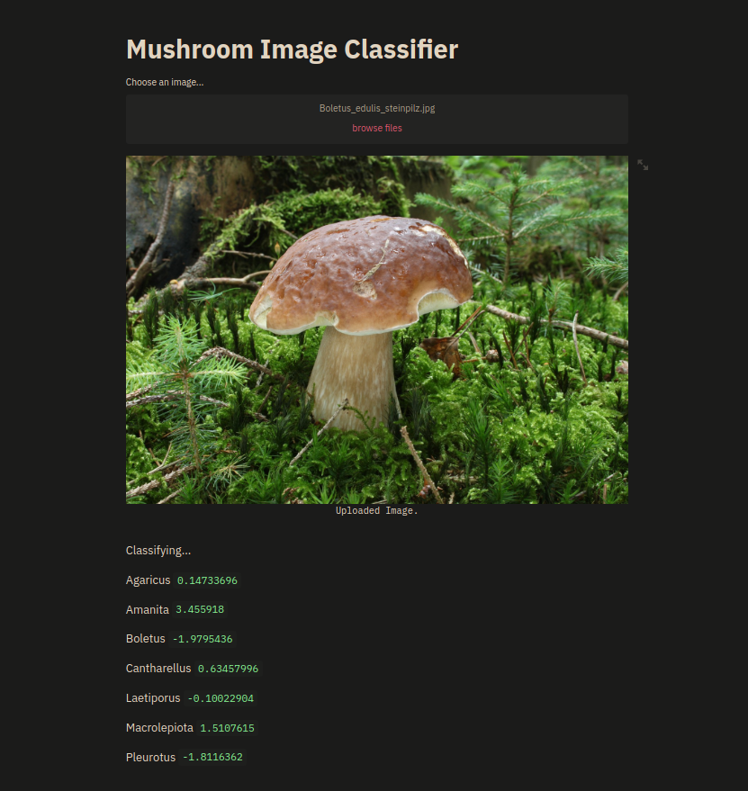

# Mushroom Image Classifier

## Purpose

This is a simple mushroom image classifier web app, aiming to tell you the likely genus of a mushroom image

## Approach

The classifier is trained on a dataset of representative labelled mushroom images downloaded using the google-images-download library: https://github.com/hardikvasa/google-images-download 

The image classifier implemented using transfer learning with the MobileNetV2 model, trained with TensorFlow and TensorFlow Hub based on a workflow presented here:
https://colab.research.google.com/github/tensorflow/hub/blob/master/examples/colab/tf2_image_retraining.ipynb#scrollTo=RaJW3XrPyFiF.

## Usage

Simply upload an image using the drop down menu and the most likely mushroom family will be returned

